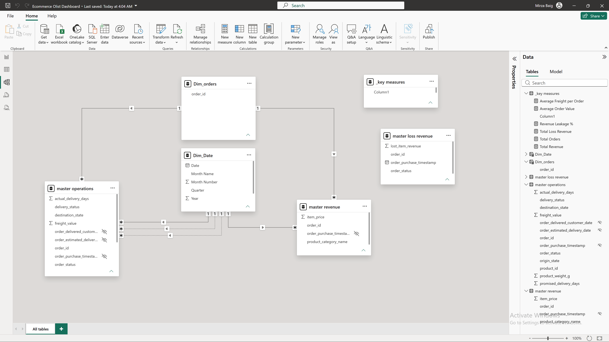

# Enterprise E-Commerce & Supply Chain Analytics (Databricks SQL Medallion Architecture to Power BI)

## Executive Summary & Business Context
In multi-channel e-commerce operations, reporting directly off raw transactional databases creates two severe bottlenecks: dashboard query latency and fragmented business logic. In this project, I analyzed over **99,000 orders** generating **$1.20M in gross pipeline revenue** from Brazilian e-commerce operations (Olist dataset). 

The primary business objectives were to solve two operational challenges:
1. **Financial Revenue Leakage:** Isolating why **$97.24K (8.12% of total pipeline revenue)** was trapped or lost in canceled and unavailable orders.
2. **Logistics & Transit Bottlenecks:** Identifying why regional delivery times in remote states like Roraima (RR) averaged **26.0 days**—more than double the national baseline of **12.3 days**—with freight costs averaging **$22.78 per order**.

To keep front-end Power BI dashboards fast and responsive, I engineered an upstream **Databricks SQL Medallion Architecture (Bronze -> Silver -> Gold)** using Delta Lake. Shifting 90% of data cleaning, temporal conversions, and star schema modeling into the cloud warehouse eliminated client-side calculation lag completely.

---

## Technical Stack & Architecture
* **Data Platform:** Databricks / Spark SQL
* **Storage Format:** Delta Lake (ACID-compliant)
* **Data Warehousing:** Medallion Architecture (Bronze, Silver, Gold Layers)
* **Business Intelligence:** Power BI (Import Mode / Star Schema Data Model)

```
ecommerce-databricks-sql-medallion-pipeline/
├── README.md                                          # Documentation & executive insights
├── databricks_sql_scripts/
│   ├── 01_bronze_ingestion.sql                        # Raw Delta table migration
│   ├── 02_silver_transformations.sql                 # Data sanitization & timestamp parsing
│   ├── 03_gold_star_schema.sql                        # Analytics-ready Fact tables & Star Schema
│   └── 04_executive_adhoc_analysis.sql                # Advanced C-Suite ad-hoc SQL queries
└── power_bi_assets/
    └── documentation_images/
        ├── data_model.png                             # Star Schema ERD Diagram
        ├── page1_finance.png                          # Executive Financial Performance Dashboard
        └── page2_logistics.png                        # Logistics & Supply Chain Dashboard
```

---

## Pipeline Data Flow

```text
       [Raw Transactional & Operational Extracts]
                         │
                         ▼
       🟤 BRONZE LAYER  : Raw Delta Lake Migration (`01_bronze_ingestion.sql`)
                         │
                         ▼ (Timestamp Parsing, Schema Enforcement, Null Filtering)
       ⚪ SILVER LAYER  : Cleaned Operational Tables (`02_silver_transformations.sql`)
                         │
                         ▼ (Star Schema Joins & Upstream Performance Pre-Calculations)
       🟡 GOLD LAYER    : Production Fact Tables (`03_gold_star_schema.sql`)
                         │
                         ▼ (Lightweight Import / DirectQuery)
       📊 POWER BI      : Executive Financial & Logistics Dashboards
```

---

## Engineering Deep-Dive by Layer

### 🟤 1. Bronze Layer: Ingestion & Lineage (`01_bronze_ingestion.sql`)
* Migrated raw transactional landing tables into the `ecommerce_logistics.bronze` catalog.
* Stored data as Delta Lake tables to establish ACID compliance, data versioning, and clear lineage across orders, customers, items, products, sellers, and geolocation datasets.

### ⚪ 2. Silver Layer: Sanitization & Type Conversion (`02_silver_transformations.sql`)
* **Timestamp Normalization:** Text-formatted date fields (e.g., `order_purchase_timestamp`) were converted to Spark SQL `TIMESTAMP` data types to enable high-precision date arithmetic.
* **Integrity Filtering:** Enforced null-handling checks on primary join keys (`order_id IS NOT NULL AND customer_id IS NOT NULL`) to protect foreign key relationships downstream.

```sql
CREATE OR REPLACE TABLE ecommerce_logistics.silver.olist_orders AS
SELECT
    order_id,
    customer_id,
    order_status,
    -- Normalizing string date values to standard TIMESTAMP types
    CAST(order_purchase_timestamp AS TIMESTAMP) AS order_purchase_timestamp,
    CAST(order_approved_at AS TIMESTAMP) AS order_approved_at,
    CAST(order_delivered_carrier_date AS TIMESTAMP) AS order_delivered_carrier_date,
    CAST(order_delivered_customer_date AS TIMESTAMP) AS order_delivered_customer_date,
    CAST(order_estimated_delivery_date AS TIMESTAMP) AS order_estimated_delivery_date
FROM ecommerce_logistics.bronze.olist_orders
WHERE order_id IS NOT NULL
  AND customer_id IS NOT NULL;
```

### 🟡 3. Gold Layer: Star Schema & Upstream Metrics (`03_gold_star_schema.sql`)
* **Pre-Computing Transit Days & Delivery Status:** Calculated `actual_delivery_days`, `promised_delivery_days`, and an upstream `delivery_status` SLA flag directly in the `master_operations` Fact table.
* **Financial Risk Fact Table:** Built a focused `lost_revenue` Fact table isolating canceled and unavailable orders for immediate auditing.

```sql
CREATE OR REPLACE TABLE ecommerce_logistics.gold.master_operations AS
SELECT
    o.order_id,
    o.order_status,
    oi.product_id,
    oi.price,
    oi.freight_value,
    c.customer_state AS destination_state,
    s.seller_state AS origin_state,
    p.product_weight_g,
    o.order_purchase_timestamp,
    o.order_delivered_customer_date,
    o.order_estimated_delivery_date,
    -- Pre-calculating transit intervals upstream
    DATEDIFF(o.order_delivered_customer_date, o.order_purchase_timestamp) AS actual_delivery_days,
    DATEDIFF(o.order_estimated_delivery_date, o.order_purchase_timestamp) AS promised_delivery_days,
    -- Pre-calculating SLA delivery status flag
    CASE 
        WHEN o.order_delivered_customer_date > o.order_estimated_delivery_date THEN 'Late'
        ELSE 'On-Time'
    END AS delivery_status
FROM ecommerce_logistics.silver.olist_orders o
LEFT JOIN ecommerce_logistics.silver.olist_order_items oi ON o.order_id = oi.order_id
LEFT JOIN ecommerce_logistics.silver.olist_customers c   ON o.customer_id = c.customer_id
LEFT JOIN ecommerce_logistics.silver.olist_sellers s     ON oi.seller_id = s.seller_id
LEFT JOIN ecommerce_logistics.silver.olist_products p     ON oi.product_id = p.product_id
WHERE o.order_status = 'delivered'
  AND o.order_delivered_customer_date IS NOT NULL;
```

---

## Advanced SQL Analysis (`04_executive_adhoc_analysis.sql`)

### Month-over-Month Growth Velocity (SQL Window Functions)
To evaluate sales momentum for executive reporting, I wrote a CTE query utilizing the `LAG()` window function to track monthly revenue growth rates:

```sql
WITH monthly_revenue_ledger AS (
    SELECT
        DATE_FORMAT(CAST(o.order_purchase_timestamp AS TIMESTAMP), 'yyyy-MM') AS financial_month,
        ROUND(SUM(oi.price), 2) AS current_month_revenue,
        LAG(ROUND(SUM(oi.price), 2)) OVER (
            ORDER BY DATE_FORMAT(CAST(o.order_purchase_timestamp AS TIMESTAMP), 'yyyy-MM') ASC
        ) AS previous_month_revenue
    FROM ecommerce_logistics.silver.olist_orders o
    INNER JOIN ecommerce_logistics.silver.olist_order_items oi ON o.order_id = oi.order_id
    WHERE o.order_status = 'delivered'
    GROUP BY financial_month
)
SELECT
    financial_month,
    current_month_revenue,
    previous_month_revenue,
    ROUND(((current_month_revenue - previous_month_revenue) / previous_month_revenue * 100), 2) AS mom_growth_percentage
FROM monthly_revenue_ledger
ORDER BY financial_month;
```

---

## Data Model & Dashboard Highlights

### 1. Power BI Analytical Data Model
By pushing aggregations to the Gold layer in Databricks, the resulting Star Schema in Power BI features clean 1-to-many relationships without bidirectional filter ambiguities:



### 2. Financial & Revenue Performance Dashboard
* **Gross Pipeline Revenue:** **$1.20M**
* **Revenue Leakage:** **$97.24K (8.12% leakage rate)** stuck in unfulfilled order states.
* Enables finance teams to track monthly leakage trends and identify payment gateway drop-offs.


### 3. Supply Chain & Logistics Dashboard
* **National Average Transit Time:** **12.3 Days**
* **Regional Bottleneck:** Orders delivered to **Roraima (RR)** average **26.0 days**, driving up logistics costs and customer friction.
* Enables logistics teams to review carrier performance by origin-destination state lanes.


---

## Author & Project Info
* **Author:** Mirza Ishtiyaq Baig *(Data Analyst / Analytics Engineer)*
* **Repository:** `ecommerce-databricks-sql-medallion-pipeline`
